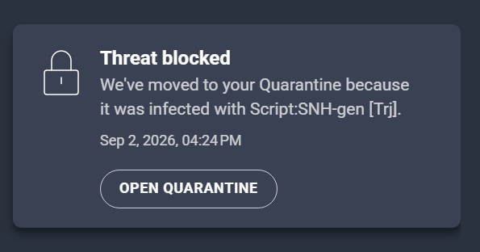
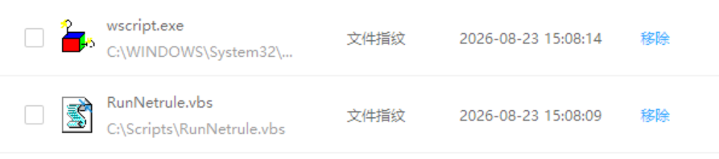

# cyber-security
Just help me to remember and note some practice

## Table of Contents

- [Assets](#Assets)
- [Network](#Network)
- [Basic Protection](#Basic-Protection)
- [SIEM](#SIEM) to do
- [phishing](#phishing) to do
- [malware](#malware) to do
- [configuration](#configuration) to do
# Assets
Before we protect or attack the company we want, we have to understand each machines purpose, what they do, how they work.

### **Computers**
The common operating systems include windows, linux, macos（sounds like something+s).

-**Windows**:  
    The os published by microsoft, the benefit is there is a company patch the system, but the patch sometimes great, sometimes sh**. They try to promot more ad, add more functions to edge and tool bar. Which cause the more source usage. :hankey:  
    However, it holds the largest market share in personal computer operating systems. Most software design to run on the windows.  
  
-**Linux**:  
    penguin :penguin:, contribute by the community, while a zero day exist, linux allow to patch it faster. My first impression to the linux is the command line, and **__no game__** (QAQ). The machine run this system can be the computer, but also can be a brick(sudo rm -rf /)  
  
-**Macos**:  
    I never used but the community say it is Best for Creative Types.  
  
-**ChromeOS**:  
    Open files, watch video, read the email or website, that is my feeling with bought the chromebook. It does not support a lots of things, but sells $500au. It have a linux built-in, just like a vm, again have a lots of limitation, but $500au. I feel stuck while I run the app by the built-in linux, but $500au.  

-**Servers**:  
  The machine receive the request and provide services. Most have no screen, no mouse, control by the client. Some of them have GUI, some not. 

-**Routers**:  
  Help to communicate in different network. Rare to see the person set the end point as the router.

-**Switchs**:  
  Help to communicate in the same network. Learn the machine address code from hosts and delivery the message.

-**IOT**:  
  Internet of things, while a thing connect to the network, it can call IOT. However, the things connect to network brings the convinient, but also more attack surface.  
  
## Network
Here is a very brief description about network

The router and switch use the address to confirm the address that message have to send.
### address
_**IPV4**_:  
4 octets, each octet contains 8 bits. For each bit can have two possible number 0 or 1, which means can have 256(2<sup>8</sup> numbers 0-255. The address will be **<0-255>.<0-255>.<0-255>.<0-255>.<0-255>**

_**IPV6**_:
8 octets, each octet contains 4 hex number.

_**MAC(not computer)**_:
Media Access Control, Network interface (NIC) assigned during manufacturing/initialization, format is like 00:50:56:c0:00:01. The first three groups are **Vendor Identifier**, the last 3 groups are **Device serial number**.

The ip address include the network bit and host bit. Like nnnnnnnn.nnnnnnnn.hhhhhhhh.hhhhhhhh(binary, n for network, h for host). Most h means can have more hosts in the network. Subnet mask, use to define the number of h or n, like the common ip address, 192.168.0.1 /24, the /24 is the CIDR(Classless Inter-Domain Routing (CIDR), which means have 24 bits for the network bits. That we can get there is 8 bits for hosts, 2<sup>8</sup> possible addresses for the host. Subnet mask, the number we enter in the configuration, 2<sup>32(total bits for address) - CIDR</sup>. For example, /23 means the mask have 23 bits, the address is nnnnnnnn.nnnnnnnn.nnnnnnnh.hhhhhhhh.hhhhhhhh . We get the subnet mask as 11111111.11111111.1111111h.hhhhhhhh(binary), 255.255.254.0(decimal).  

The local ip address is always like **10.x.x.x(large)**, **127.16.x.x(medium)**, **192.168.x.x(small)**, depending on the devices number and network size. The first and last address is always for the gateway and boardcast(network address is not allow to use, like 192.168.0.0, the first address is 192.168.0.1). While using, the gateway and boardcast can set at any address you like, but for easy to management, set it as first and last.   

**Loopback**, the server was set at local, we can use this address to access, like **127.0.0.1**, **127.0.0.0/8** or **localhost**. The data does not leave the local machine, but circulates directly within the network stack of the operating system kernel.

_**study address**_:  
There is hundred host, two in them, a and b, a 192.168.31.80 want to send data to b 192.168.31.31(same network)  
1.Search the local ARO cache: check the ARP table, had it record the ip and mac address.(The cache will be cleaned up)
2.Send the broadcast request: use availible methods to send the arp request, like the direct cable to other devices, if to the switch, switch will send this package to other devices connect to the switch.  
2.1 (if at different network)Send the package to router, router will send package to other router/boardcast in that network
3.Receive the response: only the address match to request will response, and this will record in the switch's table, and a's local cache. (The next time known the way to 192.168.31.31, not require to boardcast again)

While the hosts at different network, the router have to transform the local ip address to public ip address.


# **Basic protection**
Use the antivirus app is the first chose for most people, it don't need any knowledge or skills. The hardest is to find out the system use and architecture. Here I use the Avast, tencent computer manager, AVG, 360(because they are free to use or provide a period of free to use). Traditional antivirus mainly relies on signature-based detection, while modern endpoint protection also uses heuristic, behavioral, and machine-learning techniques.

**Signature base**  
Generate the hash and compare to the libary, relias on the hash did sumbited to the liabary. The hash would change even just a single bit in the app change.

**Behavioral base**  
Detect the action of a process take, like open a pdf that is safe, but will warning user while a word document execute the powershell(danger process, classify as maliciou marco)  
I use the command in revshells.com to make reverse shell in windows, use linux to listen to it. Save the command as file ps1, put in the exeception to prevent it place in quarantine zone automaticly. Then the linux execute the malicious command(yes, C2 again, other malicious activity will take much longer time) to windows. The command had been terminated.  
  
Maybe the ps1 is in the exeception list, the antivirous allow the reverse shell alive.

**Code analyst**  
I do like to put this same as signature, both static analyst... but different method
RunNetrule.vbs file run by wscript.exe, use wscript to run powershell command can prevent the powershell windows flash even use the hidden widows
```
Set WshShell = CreateObject("WScript.Shell")

WshShell.Run "powershell.exe -NoProfile -NonInteractive -ExecutionPolicy Bypass -File ""C:\Scripts\Netrule.ps1""", 0, False
```
```
$Folder = "<path to the file>"
$LogFile = "path to the log"

try {

    if (-not (Test-Path $Folder)) {
        "ERROR: Folder does not exist: $Folder" | Out-File $LogFile -Append
        exit 1
    }


    Get-ChildItem $Folder -Filter *.exe -File -Recurse | ForEach-Object {

        $RuleName = "Block Network - " + $_.FullName


        if (-not (Get-NetFirewallRule -DisplayName $RuleName -ErrorAction SilentlyContinue)) {

            New-NetFirewallRule `
                -DisplayName $RuleName `
                -Direction Outbound `
                -Program $_.FullName `
                -Action Block `
                -Profile Any `
                -ErrorAction Stop | Out-Null


            "$(Get-Date -Format 'yyyy-MM-dd HH:mm:ss') - CREATED: $($_.FullName)" |
                Out-File $LogFile -Append
        }
    }


    Get-NetFirewallRule |
    Where-Object DisplayName -like "Block Network -*" |
    ForEach-Object {

        $Rule = $_
        $App = $Rule | Get-NetFirewallApplicationFilter

        if ($App.Program -and -not (Test-Path $App.Program)) {


            $Rule | Remove-NetFirewallRule
        }
    }
}
catch {

    "$(Get-Date -Format 'yyyy-MM-dd HH:mm:ss') - ERROR: $($_.Exception.Message)" |
        Out-File $LogFile -Append
}
```
The command can be maliciou if it disable the firewall rule. However, only 360 mark the vbs file as trojan. I think it classify the powershell command as safe, but the vbs execute the powershell which is unwanted process. 
<picture>
 
</picture>

The antivirus apps marked a few files that is PUP or backdoor, which are the same. Um, after I delete the file, the program can not run. ***I delete those antivirus and execute it again, it allow to run. Maybe one of them kill the process and had not notice me.*** Additional, 360 disable execution all the program in usb, it is the function I had not seen in other antivirus, also, don't grab an unknow usb on street and insert to the pc.(not the promotion to 360, only describe the advantage, and I want to say, 360 tried to install more app without you known it, more like a trojan than a trojan)  
To the using, choose one of the antivirus you trust, the more does not mean better. (They fights in your pc)  

For security, antivirus can act as the guard and the asistant, use for easy manage with the suspecious or malicious file. However, we can not 100% trust or rely it, it may not detect the new malware, new technologies, new vulnerability. Also, there are a few anti-virus apps are not sensitive enough, like edit the firewall, make the C2(same network, can be the same reason that did not alert the user), give me the feel like the attacker can do a lots of things. Additionally, this is not the judgement of they are useless, they help users if they don't know how to read domain, analyst files and track the process.

# **SIEM**  
Here I use the elastic as the example, the reason is I like the visualization process tree in it.(I am using the windows, linux and mac have to use other way)

Donwload the kibana and elastic search zip files, extract it.  
In elastic/bin, enter command below to set password  
```
.\elasticsearch-reset-password.bat -u kibana_system -i
```
Config the kibana-version/config/kibana.yml, add
```
server.port: 5601
server.host: "localhost"

elasticsearch.username: "kibana_system"
elasticsearch.password: "password set"

elasticsearch.hosts: ["https://localhost:9200"]
elasticsearch.ssl.certificateAuthorities: ["path to elastic/elasticsearch-9.5.2/config/certs/http_ca.crt"]
```
Then execute the kibana-version/bin/kibana.bat and elasticsearch-version/bin/elasticsearch.bat. Wait for a moment and then access the localhost:5601.  
Add the windows integration and follow the step to extract the file.  
Download the sysmon.  
Open cmd or powershell as administrator, configure the locate to the elastic agent, configure the elastic-agent.yml
```
outputs:
  default:
    type: elasticsearch
    hosts:
      - "https://127.0.0.1:9200"
    username: "<username>"
    password: "<password>"
    preset: balanced
    ssl:
      certificate_authorities:
        - '<path to certificate> like D:\elasticsearch-9.5.2-windows-x86_64\elasticsearch-9.5.2\config\certs\http_ca.crt'

inputs:
  - type: winlog
    id: windows-security
    use_output: default
    streams:
      - name: Security
        data_stream:
          type: logs
          dataset: windows.security
          namespace: default
        winlog:
          channel: Security

  - type: winlog
    id: windows-system
    use_output: default
    streams:
      - name: System
        data_stream:
          type: logs
          dataset: windows.system
          namespace: default
        winlog:
          channel: System

  - type: winlog
    id: windows-application
    use_output: default
    streams:
      - name: Application
        data_stream:
          type: logs
          dataset: windows.application
          namespace: default
        winlog:
          channel: Application

  - type: winlog
    id: windows-sysmon
    use_output: default
    streams:
      - name: Microsoft-Windows-Sysmon/Operational
        data_stream:
          type: logs
          dataset: windows.sysmon_operational
          namespace: default
        winlog:
          channel: Microsoft-Windows-Sysmon/Operational
```
Use command to Restart the agent
```
Restart-Service "Elastic Agent"
```
Now, the search should display the events.
